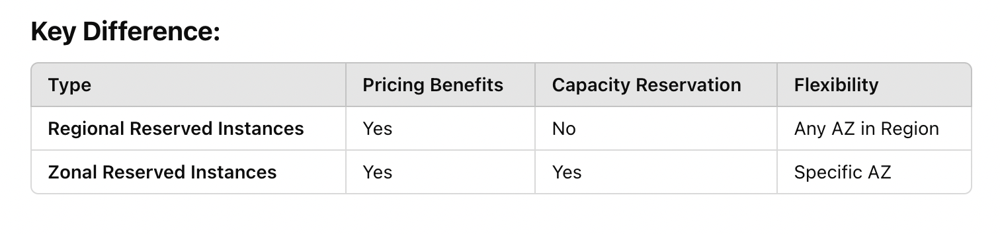

## Development

### 1. Codecommit
- CodeCommit is a managed source control service that enables teams to securely collaborate on code. Your code is secured using encryption in transit and at rest.

### 2. Optimizing Connection Management with RDS Proxy
- In a database-intensive application where frequent opening and closing of database connections adds latency, using RDS Proxy to pool connections is the best approach. RDS Proxy improves performance by reusing database connections and minimizes the overhead of connection management, ensuring better scalability and responsiveness for your application.

- Pooling connections means reusing a set of open database connections to avoid the time and resources needed to repeatedly open and close new connections. 

- Imagine a pool of database connections, like a collection or group of connections that are already open and ready to use. Instead of creating a new connection every time an app needs one, it borrows a connection from the pool. Once the app is done using the connection, it returns it to the pool so it can be reused by another request.

- While ElastiCache can cache frequently accessed data, it doesn't address the problem of frequent connection openings/closings. It's beneficial for improving data retrieval speed but not for managing database connections

- ⁠It is called a "proxy" because it acts as an intermediary between your application and the database. Instead of your application connecting directly to the database, it connects to the RDS Proxy, which then communicates with the database on your behalf. This setup helps manage database connections efficiently, reduces the load on the database, and improves application performance and availability.


### 3. Optimizing Lambda Initialization by Minimizing Libraries
- To improve the initialization performance of your Lambda function, only include the libraries that are necessary rather than the entire AWS SDK. This reduces the deployment package size, which directly speeds up the static initialization phase of the function. Reducing unnecessary libraries avoids the overhead and ensures faster, more efficient execution. 
- While adding libraries as a Lambda layer can help manage shared dependencies across multiple functions, trimming down your package size targets the root of the issue for quicker startup times.

### 4. Storing Credentials and License Keys Securely
- For storing and automatically rotating RDS database credentials, Secrets Manager is the best solution, as it supports secure storage and automatic rotation. 
- For storing license keys, Systems Manager Parameter Store is ideal, especially when using the SecureString type for encryption and security. 
- These services provide secure, scalable, and managed solutions for handling sensitive data.
- ⁠Rotation is the process of regularly updating sensitive data like passwords or API keys to improve security, ensuring old credentials become invalid. AWS Secrets Manager supports automatic rotation, making it ideal for dynamic secrets like database credentials that require regular updates. It securely manages and rotates secrets without manual effort. In contrast, AWS Systems Manager Parameter Store, often used with SecureString encryption, is better for static secrets like license keys or configuration values that don’t require frequent updates. Parameter Store is cost-effective and sufficient for these stable, infrequently changed values.

### 5. AWS CodePipeline
- CodePipeline enables you to automate your software build, test, and release processes.

### 6. Deploying Code to AWS Lambda

- For deploying code to AWS Lambda, the supported methods include:

1. Uploading a .zip file via the Lambda console
2. Uploading a .zip file to an S3 bucket for Lambda to download
3. Copying and pasting code into Lambda's built-in IDE

### 7. Using API Gateway for High-Volume REST API Handling

- To manage thousands of REST API calls per minute, API Gateway is the optimal AWS service. It offers robust features for scaling, caching, and throttling requests, enabling high performance and reliability for applications with heavy API traffic.

### 8. Using /tmp for Temporary Storage in Lambda

- For a Lambda function that needs temporary storage during execution, the /tmp directory is the optimal choice. It provides up to 512 MB of fast, local storage, ideal for handling temporary data within a single invocation, and supports efficient read/write operations during the function's processing.

### 9. Using In-place Deployment for First-Time Application Rollout

- For a first-time deployment to a brand-new fleet of EC2 instances, In-place deployment is the most straightforward and suitable option. It installs the application directly on the existing instances without the need for separate environments, making it ideal for initial deployments.

### 10. Using ElastiCache for Redis for Improved Query Performance

- To improve the performance of database queries, especially those requiring sorting and ranking, ElastiCache for Redis is an ideal solution. Redis enables quick data retrieval and supports complex operations like sorting and ranking, which can reduce the load on RDS and improve the speed of recommendation engines.

### 11. Using Blue/Green Deployment for Fast Rollback in Time-Constrained Deployments

- For a deployment with a limited time window and concerns about quick rollback, Blue/Green deployment is the recommended approach. It allows a new version to be deployed in a separate environment, enabling near-instant rollback by shifting traffic back to the original environment if any issues arise. This minimizes downtime and risk in high-stakes deployment windows.

- Canary approach deploys the new version to a small subset of instances first and then gradually rolls out to others if no issues are detected. While it helps minimize risk, it may take longer to complete the full deployment and might not provide an instant rollback if issues are found.

- Immutable deployment creates fresh instances for every update, while blue-green deployment switches traffic between two stable, identical, consistent sets environments/set of instance

-⁠ ⁠Blue-green deployment is considered the fastest because it allows a new version to be prepared in a separate environment (green) while the current version (blue) continues running without interruption. The actual deployment to the green environment happens in the background and does not affect users. Once the green environment is ready and tested, the traffic is instantly switched from blue to green, making the new version live almost immediately. This seamless transition and the ability to quickly revert to the blue environment in case of issues minimize downtime and make the process appear fast to users and stakeholders.


### 12. Using Branching for Feature Development in AWS CodeCommit

- To work on a new feature without affecting production-ready code, create a new branch from your default branch in AWS CodeCommit. This approach keeps feature development isolated, allowing you to make changes independently, test, and merge them back to the main branch when ready for release.
- CodeBuild is used for compiling and building code, not for version control or branching.

### 13. CPU Bound
- A process is considered CPU-bound when its performance is primarily limited by the speed and capacity of the CPU (Central Processing Unit). In a CPU-bound process, the code or workload relies heavily on processing power rather than on other resources like memory or disk I/O.

### 14. Optimizing CPU-Bound Lambda Functions

- For a Lambda function that is CPU-bound, increasing the memory allocation will also increase the CPU resources proportionally, allowing the function to complete faster. This is the most effective way to improve performance for Lambda functions with high CPU demands.
- ⁠In AWS Lambda, you cannot directly increase CPU resources independently. The CPU resources are tied to the memory allocation, meaning that when you increase the memory setting for a Lambda function, the CPU resources increase proportionally.


### 15. Using Mock Integration for Testing API Gateway Without a Backend

- When the backend API is unavailable, using a mock integration in API Gateway allows your team to simulate responses for testing. This enables integration testing and validation of API methods without needing a live backend, supporting efficient development and testing workflows.

### 16. CodeDeploy Lifecycle Hook Order for In-Place Deployment

- For an in-place deployment in CodeDeploy, the lifecycle hooks follow this order: ApplicationStop, BeforeInstall, AfterInstall, ApplicationStart, ValidateService. This sequence ensures that the application is stopped, updated, started again, and validated in a systematic way to minimize downtime and errors during deployment. 

### 17. Explaining each hooks

- ApplicationStop: Stops the application on the instance to prepare for the new deployment.
- BeforeInstall: Prepares the instance for installation, such as backing up existing files or removing old versions.
- AfterInstall: Executes tasks after the new application revision has been installed, such as configuring or updating files.
- ApplicationStart: Starts the new version of the application.
- ValidateService: Ensures the deployment was successful by running any tests or health checks.

### 18. Resource-Based Policy

- Resource-Based Policy is a type of policy in AWS that is attached directly to a resource to define who can access it and what actions they can perform. Unlike identity-based policies, which are attached to users, groups, or roles, resource-based policies are attached to the resource itself, allowing it to grant permissions to other AWS identities and accounts

### 19. Trust Policy as a Resource-Based Policy in IAM

- The only resource-based policy supported directly by the IAM service is a trust policy. It is used to specify which principals can assume an IAM role, enabling cross-account and cross-service access through role assumption.

- Trust policies are attached to IAM roles and define which entities (such as users, groups, or services) are allowed to assume the role. This is a specific type of resource-based policy because it is attached to the IAM role itself and grants permissions to external accounts or principals to assume the role.

### 20. Kinesis Firehose

- It is a fully managed service for capturing, transforming, and loading streaming data into destinations like S3, Redshift, or Elasticsearch. Firehose can automatically deliver data in near real-time, making it ideal for capturing large volumes of streaming data.

- To process and analyze unstructured streaming data efficiently, use Kinesis Firehose to ingest and deliver data, Lambda to transform it, S3 for persistent storage, and Athena for SQL-based querying.

### 21. Step Functions

- Step Functions enables you to build and model your serverless application as a visual workflow consisting of a series of steps where the output of one stage can be input into another.

### 22. Handling Rollbacks in CodeDeploy In-Place Deployments

- In a CodeDeploy in-place deployment, there isn't an automatic rollback feature as there is with a Blue/Green deployment, if a new version fails, the quickest way to roll back is to manually redeploy the previous version of the application using CodeDeploy. This approach ensures the failed version is replaced by the last stable version, restoring the application to its previous state.

### 23. Using TTL for Automatic Data Expiration in DynamoDB

- To automatically expire and delete items from a DynamoDB table, use TTL. This feature simplifies data management by automatically removing items after a specified duration, reducing storage costs and ensuring that outdated data is removed without manual intervention.

### 24. Optimizing Lambda Function Performance

- To improve Lambda function performance, reuse database connections by initializing them in the Lambda execution environment, and reduce the deployment package size by including only necessary libraries. These optimizations reduce cold start times and improve runtime efficiency, enhancing overall function responsiveness.

- Establishing database connections within the Lambda execution environment (outside the handler function) allows connections to be reused across invocations when the same execution environment is reused. This reduces the overhead of establishing a new connection with each function call, which can significantly improve performance.

- Including only the libraries you need reduces the deployment package size. A smaller package size leads to faster cold starts, as the Lambda service can load and initialize your code more quickly.

### 25. Using Lambda with Scheduled Events for Periodic Tasks

- Lambda is ideal for tasks that run periodically, especially those that are short-lived and stateless, as Lambda only incurs charges when the function is running.

- For a simple, stateless application that runs periodically, AWS Lambda with a scheduled CloudWatch event is the most cost-effective and reliable solution. This approach ensures that the application runs as scheduled without incurring costs outside the execution time and eliminates the need for managing any underlying server infrastructure.

### 26. Using !FindInMap for Region-Specific AMIs in CloudFormation

- In a CloudFormation template, !FindInMap [ MapName, TopLevelKey, SecondLevelKey ] is used to retrieve values from a map based on the region or other environment-specific settings. This approach allows you to dynamically select configuration values based on deployment regions, making templates flexible for multi-region deployments.

### 27. API Gateway Usage Plans 

- API Gateway Usage Plans allows you to create, manage, and expose APIs to external users, such as mobile developers, with specific quotas and throttling limits. By creating usage plans, you can offer your APIs as products to different users or groups, defining limits based on their usage requirements.

### 28. Using a CNAME Record for Third-Party Domain Mapping in Route 53

- To allow users to access a third-party-hosted application from your own custom domain, create a CNAME record in Route 53. This record type is specifically designed to map one domain name to another, enabling seamless access from www.mydomain.com to yourapp.3rdparty.com.

- Alias records in Route 53 are typically used to map custom domains to AWS resources like S3 buckets or CloudFront distributions. They can only point to specific AWS services and are not suitable for third-party domain mappings.

- An A record maps a domain to a specific IP address and not to a domain name (e.g yourapp.3rdparty.com)

### 29. Amazon EFS (Elastic File System) 

- EFS is a fully managed, scalable, and distributed file system that provides persistent storage across multiple Availability Zones. It integrates seamlessly with ECS Fargate, allowing containers in different AZs to access shared data.

- EFS is ideal for workloads that require shared storage with low-latency access, as it ensures high availability and durability across AZs.

- For ECS Fargate container tasks that need persistent, cross-AZ shared access to data volumes, Amazon EFS is the best choice.

### 30. AWS Elastic Beanstalk

- In AWS Elastic Beanstalk, configuration files are placed in a directory named .ebextensions at the root of your application source code. The configuration files within this directory must have a .config extension and follow the format .ebextensions/<filename>.config. These files allow you to configure various environment settings, such as software installations, environment variables, and AWS resource modifications.
- Once this .config file is placed in the .ebextensions folder at the root of your application. When you deploy the application, Elastic Beanstalk automatically applies these configurations to your environment.
- Elastic Beanstalk will read and apply all .config files in the folder, so ensure there are no conflicting or duplicate settings.


### 31. SQS Visibility Timeout 

- In Amazon SQS, the visibility timeout for a queue is the amount of time a message remains invisible to other consumers after being retrieved by a consumer. For the CreateQueue API, this value is in seconds and defaults to 30 seconds if not specified.

- When a consumer reads a message, the message goes into this hidden state for the duration of the visibility timeout. During this timeout, if the consumer finishes processing successfully, it can delete the message from the queue, ensuring it doesn't get processed again. If the consumer fails to delete the message (e.g., due to an error or disconnection), the visibility timeout expires, and the message becomes available for another consumer to retrieve.

- When you create a queue in SQS, you must choose between a Standard queue or a FIFO (First-In-First-Out) queue. Once the queue type is set, it cannot be changed. To switch queue types, you would need to create a new queue.

### 32. Auto Scaling Group Constraints in AWS

- Auto Scaling groups are restricted to a single Region and cannot span across multiple Regions.
- Auto Scaling groups are not limited to a single Availability Zone and can span multiple AZs within a Region for higher availability and fault tolerance.

### 33. Cross-Zone Load Balancing in Elastic Load Balancer (ELB)

- When cross-zone load balancing is enabled in an ELB, traffic is evenly distributed across all instances in all Availability Zones. Each instance receives an equal share of traffic regardless of the number of instances per zone.

### 34. Identifying SAM Templates with the Transform Section

- The presence of Transform: 'AWS::Serverless-2016-10-31' at the beginning of a YAML or JSON document indicates that it is an AWS Serverless Application Model (SAM) template. This directive allows CloudFormation to interpret and deploy serverless resources defined in the SAM syntax, simplifying serverless application management.
- The Transform directive tells CloudFormation to process the SAM-specific syntax and resources within the template, allowing for easier configuration of Lambda functions, API Gateway endpoints, DynamoDB tables, and other serverless resources.

### 35. Using a Development Stage for Isolated API Testing

- Creating a development stage on API Gateway allows developers to test new API versions independently, avoiding any disruption to the production stage. This approach is operationally efficient and minimizes maintenance overhead while isolating testing and ensuring a smooth experience for end users.
- By adding a new stage, you can deploy the updated version of the API with new endpoints and interface changes under a separate environment. This allows developers to access and test the new API functionality by pointing to the specific development stage endpoint without affecting customers on the production stage.
- Creating a development stage in API Gateway lets developers test new versions of an API in a separate environment without disrupting the live (production) version used by customers. This way, they can try out updates, new features, or changes safely. By adding a new stage, developers get a separate endpoint to test and refine the API without affecting users, making testing and development smoother and risk-free.

### 36. AWS Free Tier for T2.micro Instances

- newly created AWS accounts are eligible for the AWS Free Tier, which includes 750 hours per month of free usage on the T2.micro instance for the first 12 months.

### 37. Data Requirements for AWS Budgets Forecast-Based Alerts

- Forecast-based AWS Budgets alerts notify you when your future spending is expected to exceed your set budget. These alerts are based on predictions from your past usage patterns. They provide early warnings, allowing you to adjust your resource usage or budget to prevent overspending.
- AWS Budgets needs about 5 weeks of historical usage data to generate accurate forecast-based alerts. For new accounts or recently created budgets, alerts may not be immediately available until sufficient data is collected.

### 38. Efficient Game Information Storage in DynamoDB
- To efficiently store and query game information for a gaming company, a DynamoDB table with a primary key composed of game name as the partition key and game version number as the sort key, combined with a Global Secondary Index (GSI) using category as the partition key and name as the sort key, offers a flexible, scalable solution.
- Primary Key: game_name (partition key) and game_version (sort key) let you query a specific game's versions.
- GSI: category (partition key) and game_name (sort key) allow you to query all games in a particular category, regardless of version.
- This flexibility makes GSIs essential for efficiently handling different types of queries in a scalable manner.
- The primary key of a DynamoDB table limits how you can retrieve data (partition key + sort key). If you need to query data based on other attributes (e.g., category or user ID), a GSI lets you do that.
- GSIs allow optimized querying without scanning the entire table, improving response times for queries on non-primary keys.
- It provides additional querying capabilities or options by letting you query data using attributes other than the primary key of the table. It essentially expands how you can retrieve and filter data, making your database more flexible and efficient for different query needs.

### 39. Using the --region Parameter for Region-Specific AWS CLI Commands
- To execute AWS CLI commands in a different region without changing your default configuration, use the --region parameter. This approach is efficient and allows you to operate across multiple regions seamlessly within a single command.

### 40. Using Amazon RDS Read Replicas for Read-Heavy Workloads
- To improve read performance in a read-heavy application with minimal development effort, set up Amazon RDS read replicas. This approach offloads read queries to replicas, enhancing performance without the added complexity of managing a separate caching layer, and provides seamless scaling for future read demands.
- ead replicas allow you to offload read requests from the primary database instance to one or more read-only replicas, which helps distribute the read load and improves performance. Since read replicas are fully managed by RDS, they automatically replicate data from the primary instance, making them an efficient, scalable, and low-maintenance solution.

### 41. Deleting an SQS Queue After Testing
- To delete an SQS queue along with its contents, use the DeleteQueue API. This action ensures that the queue and all associated messages are permanently removed, meeting the cleanup requirement after testing.

### 42. Ensuring Idempotency with DynamoDB for Lambda-Backed APIs
- To ensure reliable and consistent processing of potentially duplicate requests in a Lambda-backed API, store unique request identifiers in a DynamoDB table. By having the Lambda function check for existing identifiers before processing, this solution efficiently handles idempotency, provides durability, and scales well for fluctuating workloads, making it an ideal fit for the gaming application's needs.
-  ⁠Unique request identifiers are special IDs assigned to each request to ensure it is processed only once. These identifiers are unique for every API call, like a fingerprint for each request. For example, it could be a combination of a user ID, timestamp, or a randomly generated unique value (e.g., UUID).
- In a Lambda-backed API, a request might accidentally be sent multiple times due to retries or network issues. By storing and checking these unique IDs in a DynamoDB table:
- The system can identify if a request has already been processed.
- It prevents duplicate processing, ensuring the operation is idempotent (produces the same result even if repeated).

### 43. Reserved Instance
- A Reserved Instance in AWS is a pricing model that allows you to commit to using a specific instance type within a particular region for a one- or three-year term.
- is a way to save money by committing to use a specific type of server for a longer time (like 1 or 3 years)
- In return for this commitment, you get a significant discount compared to on-demand pricing. Reserved instances are ideal for workloads with predictable usage, as they help reduce costs while ensuring capacity is available when you need it.

### 44. AWS Reserved Instance Billing
- When multiple instances of the same type are running and only one Reserved Instance is available:

    - The Reserved Instance discount applies to one instance.
    - Any additional instances are billed at the On-Demand rate for the same time period.
    - This ensures efficient cost management while leveraging Reserved Instances for predictable workloads.
- ⁠For example: If you reserve 1 m5.large instance and you run 3 m5.large instances at the same time. The first instance gets the Reserved Instance discount. The other two instances are charged at the regular On-Demand rate.

### 45. Scaling Policy and Auto Scaling Constraints

- When an Auto Scaling policy attempts to add more instances than the maximum capacity the Auto Scaling group allows, Auto Scaling ensures that the number of instances does not exceed the configured maximum.
- This means it is possible to have an Auto Scaling policy that attempts to exceed the constraints (minimum, maximum, or desired capacity) of an Auto Scaling group. However, AWS Auto Scaling ensures that these constraints are never violated.

### 46. Regional and zonal reserved Instances



- Reserved" in Zonal Reserved Instances refers to both the pricing discount and the guaranteed capacity reservation.
- Regional Reserved Instances allow your EC2 instances to run in any AZ within the selected Region, providing greater operational flexibility compared to Zonal Reserved Instances.
- The term "Reserved" in Regional Reserved Instances refers to cost savings through reservation, not guaranteed capacity. For capacity reservations, Zonal Reserved Instances are the appropriate choice, as they combine pricing benefits with the assurance of available capacity in a specific Availability Zone.

### 47. Deleting AWS CloudFormation Stacks with Dependencies

- When deleting stacks in AWS CloudFormation:

- Start with stacks that depend on other stacks (e.g., Stack B and Stack C in this case).
- Delete the foundational stack last (e.g., Stack A) after all dependent stacks are deleted.
- This ensures a smooth deletion process without dependency-related errors.

### 48. Automating Workflows with AWS Step Functions

- For automating and tracking workflows like order fulfillment and inventory management, AWS Step Functions is the best choice. 
- It provides state management, error handling, and seamless service integration, enabling you to build a reliable and scalable solution for end-to-end process automation. 
- Other services like SQS and SNS are better suited for decoupling and message distribution but lack the orchestration capabilities required for complex workflows.

### 49. Minimizing IAM Permissions for DynamoDB Upserts (i.e retrieve an item and update some of its attributes or create the item if it does not exist.)
- To perform an upsert operation in DynamoDB using AWS Lambda with minimal permissions:
- Use dynamodb:UpdateItem to update or insert items as needed.
- Use dynamodb:GetItem to retrieve existing item attributes when necessary.
-⁠ ⁠Using UpdateItem and GetItem in DynamoDB for upserts minimizes IAM permissions by allowing specific updates or retrievals without overwriting entire items or accessing too much data. Actions like PutItem and Query are broader because they can overwrite items or fetch multiple records, which may expose unnecessary data or cause unintended changes. Upsert is a mix of "update" and "insert," making it a simple way to describe creating or updating data in one step.

### 50. EBS Volumes Are AZ Locked

- EBS volumes can only be attached to EC2 instances within the same Availability Zone. To use an EBS volume in a different AZ, take a snapshot of the volume and create a new volume in the desired AZ.

### 51. Using IAM Roles for Cross-Account Access btw ec2 and s3

- Create an IAM role in Account B with S3 access and set Account A as a trusted entity.
- Attach a role to EC2 instances in Account A with permissions to assume the role in Account B.
- This approach ensures secure and temporary access to sensitive data while following AWS best practices for cross-account access and resource management.

### 52. Using DynamoDB for Backups and Data Export

- To export DynamoDB data to Amazon S3 for local use, you can use services like AWS Data Pipeline, AWS Glue, or Amazon EMR with Hive. DynamoDB on-demand backups are not suitable for this purpose, as they do not support direct exports to S3 or local downloads. 

### 53. Understanding Storage Types and Performance Limits

- There are different types of storage for different needs. General Purpose SSDs (gp2/gp3) are for everyday use, io1 and io2 are for high-performance needs, and HDDs (st1/sc1) are for big or rarely accessed data. 
- Storage "speed" means how fast it handles tasks, measured in IOPS (number of actions per second) and throughput (amount of data moved per second). 
- For io1, the speed limit is 50 times the size of the storage, so a 200 GiB storage can go up to 10,000 IOPS. io2 is faster, with a 500:1 limit, so 200 GiB can handle up to 100,000 IOPS. Higher performance is for tasks like big databases, but it costs more.

- For General Purpose SSD (gp2) volumes, the speed is 3 times the size of the storage, up to a maximum of 16,000 IOPS per volume(i.e 5333 GiB or 5.3 TiB). Increasing the volume size beyond this point does not increase IOPS further but provides additional storage capacity.

### 54. Step Function State 

- In AWS Step Functions, a state is like a step or stage in a process. Each state represents a specific action or decision in your workflow. For example:

- Task State: Performs a unit of work, like running a function or calling a service.
- Wait State: Pauses the workflow for a set time or until a specific event.
- Choice State: Makes a decision based on conditions, like "if this, do that."
- Fail State: Stops the workflow and shows that something went wrong.
- Succeed State: Marks the end of a successful workflow.

### 55. Example of State

"HelloWorld": {
  "Type": "Task",
  "Resource": "arn:aws:lambda:us-east-1:123456789012:function:HelloFunction",
  "Next": "AfterHelloWorldState",
  "Comment": "Run the HelloWorld Lambda function"
}

- Type: Task:

    - The Type: Task state is designed to represent a single unit of work performed by a state machine in AWS Step Functions.
    - It invokes an AWS service (e.g., Lambda, ECS) or integrates with a custom application using the Resource field.

- Details of "HelloWorld" State:
    - It uses the Resource field to invoke the HelloFunction Lambda function.
    - The Next field specifies the state to transition to after the task is complete.
    - This state represents an active work unit, as it executes code or interacts with a resource.

### 56. Using Cognito Identity Pools for Secure Third-Party Access

- Cognito Identity Pools are the best choice for enabling trusted third-party users to access DynamoDB.

### 57. Amazon Kinesis Firehose

- Amazon Kinesis Firehose is like a delivery truck for data, collecting streams of information from places like websites or apps and delivering it to destinations like storage (S3, Redshift), databases (Redshift), or analytics tools (Elasticsearch). It can also clean and format the data along the way if needed. It ensures your data moves smoothly and arrives in the right format, ready to be used.

### 58. Transform Section in SAM Templates

- The presence of the Transform: 'AWS::Serverless-2016-10-31' section in a YAML document indicates that the template is a Serverless Application Model (SAM) template. This directive tells AWS CloudFormation to process the template using the SAM framework.

### 59. Conditional Writes in DynamoDB:

- Conditional writes allow you to specify conditions that must be satisfied before DynamoDB processes a write operation.
- For example, you can ensure that an item does not already exist before creating it, or check specific attribute values before overwriting an item.
- This feature prevents unintentional overwrites and helps maintain data consistency.

### 60. API & API Gateway

- An API (Application Programming Interface) is like a menu in a restaurant—it shows you the options (services) a system provides and lets you order (request) what you need without knowing how everything works in the kitchen (the system behind it). For example, an app might use an API to fetch weather data or send a message.

- An API Gateway is like the host at the restaurant, making sure your order gets to the right kitchen, ensuring everything is handled securely, and returning the result (your meal). It helps manage and control access to the APIs, making it easier to connect apps and services.

### 61. Redeploying API Gateway APIs for Updates

- When you make changes to an API in Amazon API Gateway (like updating features or fixing something), those changes don't automatically go live. To make them active, you need to "redeploy" the API. Redeployment updates the API to an existing "stage" (like a version or environment) or creates a new one.

- To ensure changes made to an API in API Gateway are reflected when the API is called, you must redeploy the API to an existing stage (e.g., dev) or create a new stage (e.g., test). By redeploying, you ensure that the changes are applied and available at the API's public endpoint, so users can access the updated version.

### 62. Transaction block and Transactional API

- A transaction block is like a deal where either everything happens together, or nothing happens at all. For example, if you're transferring money between two wallets, you first take money out of one wallet and then add it to the other. If anything goes wrong at any step, the transaction is canceled entirely, ensuring both wallets stay accurate.

- DynamoDB's transactional API allows you to perform multiple operations (like writes, updates, or deletes) across one or more items as a single, atomic transaction. This means that either all the operations in the transaction succeed together or, if any operation fails, the entire transaction is rolled back. 

### 62b. Ensuring Atomic Operations in DynamoDB

- For scenarios where multiple tables in DynamoDB need to be updated simultaneously with an all-or-nothing guarantee, use the TransactWriteItems API.

### 63. Ensuring Transactional Consistency in Databases

- To ensure atomic updates (all operations in the transaction either succeed together or fail together) during operations like transferring gift vouchers:

    - Use transaction blocks in relational databases like RDS MySQL to group operations and maintain consistency.
    - Use DynamoDB transactional APIs to handle multiple operations as a single, all-or-nothing unit.

### 64. strongly consistent vs eventually consistent

- A strongly consistent read in DynamoDB ensures that you always get the most up-to-date data, reflecting all recent writes to the item. This is useful when accuracy is critical, but it may have slightly higher latency and consume more resources. 

- An eventually consistent read, on the other hand, may return stale data for a short period as DynamoDB prioritizes performance and availability over immediate consistency. Eventually consistent reads are faster, use fewer resources, and are suitable for scenarios where slight delays in data updates are acceptable.

### 65. RCUs

- A Read Capacity Unit (RCU) in DynamoDB is like a measure of how much reading power your table has. One RCU lets you read one small piece of data (up to 4 KB) per second if you need the most up-to-date information(strong consistency), or two pieces per second if a small delay is okay(eventual consistency). 

- If the item is larger, additional RCUs are required.

- RCUs are important because they make sure your app can handle all the reading it needs without slowing down, and they help you control costs by not using more power than necessary.

### 66. Calculating Read Capacity Units in DynamoDB

- If 1 RCU is required to perform 1 strongly consistent read per second for a 4 KB item, then 10 RCUs would be needed to handle 10 strongly consistent reads per second of the same item size. 
- However, for items larger than 4 KB, such as a 6 KB item, DynamoDB rounds up to the next 4 KB increment, treating it as an 8 KB item. This means each read would require 2 RCUs. 
- Consequently, for 10 strongly consistent reads per second of 6 KB items, the total capacity required would be 10 × 2 = 20 RCUs.
-  ⁠For eventually consistent reads in DynamoDB:

-⁠  ⁠They consume half the RCUs compared to strongly consistent reads.

-⁠  ⁠4 KB items: 1 eventually consistent read per second for a 4 KB item = 0.5 RCUs. Example: 10 reads of 4 KB items = 5 RCUs.

-⁠  ⁠Items larger than 4 KB: DynamoDB still rounds up to the next 4 KB increment. For a 6 KB item (treated as 8 KB), it requires 1 RCU per read (half of 2 RCUs for strongly consistent reads).

-⁠  ⁠Total RCU: For 10 eventually consistent reads per second of 6 KB items, the total RCU required = 10 × 1 = 10 RCUs.

### 67. Using Delay Queues for Postponed Message Delivery

- To postpone the delivery of new messages in Amazon SQS, use delay queues. This feature allows you to introduce delays of up to 15 minutes
- visibility timeout is used to hide a message from other consumers while it is being processed. It does not postpone the initial delivery of messages to the queue.
- Dead-letter queues (DLQs) handle failed message processing by storing messages that cannot be successfully processed after a maximum number of retries.

### 68. Understanding gp2 Volume Performance

- For General Purpose SSD (gp2) volumes, the maximum IOPS of 16,000 is achieved at 5.3 TiB. Increasing the volume size beyond this does not improve IOPS, as performance is capped, but allows for additional storage capacity. 

### 69. Optimizing CPU-Bound Lambda Functions

- To optimize a CPU-bound AWS Lambda function for performance and ensure fast response times, increase the function's memory allocation.

### 70. Using S3 and CloudWatch Logs for Build Reporting

- To track and report on AWS CodeBuild activity effectively, use both S3 and CloudWatch Logs. S3 stores logs for a long time, letting you search and analyze them later with tools like Athena. CloudWatch Logs gives you real-time updates and helps monitor performance as builds happen. Together, they provide a complete and efficient way to keep track of build details and activity.

### 71. Ensuring Accurate Reads in DynamoDB

- For applications requiring the most up-to-date value of an item, such as high-frequency trading systems, use ConsistentRead = true in the GetItem operation. This ensures strongly consistent reads and avoids stale data issues when multiple updates occur simultaneously. 

- By default, DynamoDB uses eventual consistency for read operations, which might return stale data if updates are still being propagated.
Setting ConsistentRead = true for a GetItem operation ensures that the most recent and accurate version of the item is retrieved after an update.

### 72. AWS Lambda Environment Variable Limits
- In AWS Lambda, you can add as many environment variables as you want, but the total size of all the variables combined cannot be more than 4 KB. This includes both the names of the variables and their values. So, while the number of variables is unlimited, their total size has to fit within this limit.

### 73. Simplified Data Workflow Orchestration
- When a solution requires tasks to run in sequence and needs to handle reprocessing of data in case of errors, AWS Step Functions is the best choice. It provides orchestration capabilities that manage tasks step-by-step, enable retries, and handle errors automatically.

- This is different from services like Amazon Kinesis Data Streams, which are designed for real-time data streaming or AWS Glue for data preparation, i.e for extracting, transforming and loading data

### 74. Simplified Authentication with Cognito
- When building a mobile application that requires user registration and managed authentication, Cognito User Pools is the best choice.

### 75. Dead Letter Queues (DLQs and Lambda
- Dead Letter Queues (DLQs) are used with asynchronous Lambda calls because the caller doesn't wait for the result and can't handle errors directly. If the function fails, Lambda retries, and if it still doesn't work, the event goes to the DLQ for review or fixing. 
- In asynchronous Lambda calls, the caller doesn't wait because it's designed to quickly hand over the task to Lambda and move on. This is useful when the caller doesn't need the result immediately or doesn't want to be delayed
- In synchronous calls, the caller waits for the result, so any errors are returned right away for the caller to handle, making a DLQ unnecessary.

### 76. ElastiCache Usage
- Improve latency and throughput for read-heavy application workloads: This is a great fit because ElastiCache can store frequently accessed data in memory, making reads much faster than querying a database repeatedly.

- Improve performance of compute-intensive workloads: ElastiCache can offload computation-heavy operations by caching the results of frequent, expensive queries or computations.

### 77. SQS Extended Client
- The SQS Extended Client library allows you to store the payload of larger messages in Amazon S3 and only send a reference to the message in SQS. This way, you can bypass the 256 KB limit of SQS by offloading the actual data to S3, while SQS handles the message metadata.
- To handle messages larger than 256 KB in Amazon SQS, the SQS Extended Client Library allows message payloads to be stored in Amazon S3, overcoming the size limitation efficiently.

### 78. X-Forwarded-For header
- An Application Load Balancer (ALB) acts as a proxy, meaning it handles client requests by terminating the original connection and creating a new one to the backend server. Because of this, the backend server sees the ALB's IP address instead of the client's original IP. To solve this, ALB includes the client's real IP in the X-Forwarded-For header, which the backend can read for logging, tracking, or compliance purposes. 
- This ensures the backend knows who the actual client is while still benefiting from the ALB's proxy functions like load balancing and security.
- The X-Forwarded-For (XFF) header is a request header that identifies the IP addrress of a client that connects to a web server through a proxy server

### 79. Amazon Kinesis Data Streams vs Amazon Kinesis Data Firehos
- Amazon Kinesis Data Streams is designed for real-time processing of large streams of data records, allowing you to build custom applications that can analyze or process data as it arrives. It provides flexibility in directing data to various destinations and supports complex processing workflows.
- Amazon Kinesis Data Firehose is a fully managed service for delivering real-time streaming data to destinations like Amazon S3, Amazon Redshift, Amazon OpenSearch Service, and Splunk. It is optimized for simple data delivery pipelines and handles data transformation and scaling automatically, but it doesn't offer the same level of control over data processing as Kinesis Data Streams. 
- Firehose is limited to specific destinations like S3, Redshift, OpenSearch, and Splunk, and it's mainly for simple, automatic data delivery. It's not as flexible as Kinesis Data Streams, which lets you send data anywhere and handle more complex, real-time processing.

### 80. GenerateDataKey API
- The GenerateDataKey API provides a secure way to handle large data encryption in AWS KMS. It returns both the plaintext and encrypted versions of the key.
- Envelope Encryption is a method where data is encrypted using a data key, and that data key itself is encrypted using a master key (such as an AWS KMS key).
- The GenerateDataKey API provides both the plaintext data key (for encryption) and the encrypted version of the key (to store securely).
- The Encrypt API is used for directly encrypting small data (up to 4 KB) and is not practical for encrypting large objects

### 81. S3 Replication
- S3 lifecycle actions are not replicated. Lifecycle rules (like transitioning to different storage classes or deleting objects) are specific to the bucket where they are defined and are not replicated to the target bucket.
- Also, replication can be tailored to specific prefixes or objects based on tags. This provides granular control over which data gets replicated, making replication efficient and customizable. i.e. you can choose exactly which files or folders (prefixes) to replicate by using tags or specific patterns. This means you don't have to replicate everything in your bucket—you can pick only the data you need.

### 82. Lambda aliases
- AWS Lambda aliases are named pointers to specific versions of Lambda functions, allowing you to manage and invoke different function versions easily. For example, you can create an alias named "PROD" that points to the production version of your function. 
- When you update the function, you can change the alias to point to the new version without altering the function's ARN. This approach simplifies deployment and version management.
- An ARN (Amazon Resource Name) is a unique identifier used in AWS to specify a resource, like an S3 bucket, Lambda function, or EC2 instance, within your AWS account.

### 83. Lambda aliases and traffic routing

- Lambda aliases allow you to route traffic between different versions of a Lambda function.
- You can set a weighted routing configuration, for instance, routing 90% of the traffic to version 1 and 10% to version 2.
- To gradually introduce a new Lambda version, AWS Lambda aliases allow traffic to be split across versions using weighted routing. 
- This feature is ideal for incremental rollouts, minimizing risks and allowing controlled testing of new features.

### 84. IAM Users and SSE-KMS

- When using SSE-KMS for S3 bucket encryption, ensure IAM users have the kms:GenerateDataKey permission in their policy. This allows them to generate encryption keys required for writing objects, avoiding "access denied" errors.
- When the IAM user tries to write (PutObject) to the bucket, they need permissions not only for S3 actions but also for KMS actions, specifically kms:GenerateDataKey, to generate the encryption key used to encrypt the object.

### 85. S3 object key
- An S3 object key is the unique identifier for a file (or object) stored in an S3 bucket. It works like the file path in a folder structure and includes the full name and path of the object inside the bucket, such as photos/user1/profile.jpg. Together with the bucket name, it helps locate the object in S3.

### 86. Secure and Efficient Display of User Profile Photos
- To securely show user profile photos from a private S3 bucket, store the S3 object key in DynamoDB, and use a Lambda function to generate pre-signed URLs when needed, ensuring secure, scalable access without making the bucket public or storing the actual photo files in the database.
- The object key is the unique identifier for a file stored in an S3 bucket, while a pre-signed URL is a temporary, secure link generated using that object key, allowing access to the file without making the bucket public. The pre-signed URL is created using the object key, bucket name, and expiration time, ensuring that only authorized users can access the private object for a limited period.
- Use DynamoDB to store S3 object keys and a Lambda function to generate pre-signed URLs for secure, temporary access to private S3 photos, avoiding public exposure and database storage of binary data.
- Avoid storing binary data like images directly in databases to minimize costs and improve performance.

### 87. Optimizing Lambda Performance for Compute-Heavy Tasks
- To handle compute-heavy workflows, adjust the Lambda memory allocation, as it increases both memory and CPU resources. This is the simplest and most effective way to improve performance for tasks demanding higher computational power.

### 88. Lambda Provisioned Concurrency
- Provisioned Concurrency ensures that a specific number of Lambda function instances are always pre-warmed and ready to handle requests, reducing cold start delays. It's useful for applications needing low latency, like real-time APIs.

### 89. Lambda Reserved Concurrency
- Reserved Concurrency limits the maximum number of instances that can run simultaneously for a Lambda function, ensuring that other functions have enough concurrency to run. It's used to manage resources and prevent a single function from overloading the system.
- Reserved Concurrency in AWS Lambda sets a limit on the maximum number of instances a specific Lambda function can run at the same time. 
- This ensures that the function doesn't use up all available concurrency in your account, leaving room for other functions to run. If the reserved limit is reached, additional requests to that function are throttled until some instances free up.

### 90. Enabling Detailed Monitoring for EC2 Instances
- To enable detailed monitoring on an existing EC2 instance, use the aws ec2 monitor-instances command with the --instance-ids flag followed by the instance ID, ensuring additional metrics are collected at a 1-minute interval for better analysis, instead of the default 5-minute interval.
- The monitor-instances command in the AWS CLI is specifically used to enable detailed monitoring for already running EC2 instances.

### 91. Choosing AWS Step Functions for Workflow Management
- For workflows requiring human approval or long-running, auditable processes, Standard Workflows are the ideal choice due to their durability, detailed execution history, and flexibility. 
- Express Workflows are better suited for high-frequency, short-duration, event-driven use cases. Express Workflows have a maximum duration of five minutes and Standard workflows have a maximum duration of one year.

### 92. Kinesis Data Streams for Real-Time Ordered Data Processing
- AWS Kinesis Data Streams is designed to provide a reliable, scalable solution for real-time streaming of data, maintaining the order of events within shards. 
- While it does not perform the actual billing and auditing workflows, it ensures that ordered clickstream data is available for external applications to process these workflows effectively. 
- This makes it the ideal choice for scenarios where strict event ordering and processing consistency, such as billing and auditing in regulated industries, are critical. 
- The actual logic for billing and auditing is implemented in consumer applications that read from Kinesis Data Streams.

### 93. Simplifying Ownership with S3 Object Ownership
- When multiple users or accounts upload objects to a shared S3 bucket, the ownership of the objects by default lies with the uploader. This can create challenges in managing access and permissions.
- By enabling S3 Object Ownership and setting it to "Bucket Owner Preferred," all objects uploaded to the bucket are automatically owned by the bucket owner. This feature works irrespective of the AWS account used for uploading, simplifying ownership and management responsibilities.

### 94. Amazon API Gateway Caching
- You can enable API caching in Amazon API Gateway to cache your endpoint's responses. With caching, you can reduce the number of calls made to your endpoint and also improve the latency of requests to your API. 

### 95. Built-in Scalability of Amazon SQS
- Amazon SQS is designed to handle high-throughput workloads without any manual intervention. It is inherently scalable, allowing it to manage millions of requests per second without requiring pre-configuration or scaling adjustments. 

### 96. Long-Term RDS Backup Solution
- To meet compliance needs that exceed RDS's automatic backup retention limits, use manual snapshots triggered by a scheduled CloudWatch event and AWS Lambda.
- you can automate the creation of monthly RDS snapshots using a CloudWatch scheduled event (cron expression) that triggers an AWS Lambda function. 
- The Lambda function can initiate a manual snapshot of the RDS database, and manual snapshots are retained indefinitely, satisfying long-term compliance requirements

### 97. Serverless Docker Deployment with ECS Fargate
- Amazon ECS on Fargate provides a serverless solution for running Docker containers, eliminating the need to manage EC2 instances or the underlying infrastructure. 
- It automatically provisions and scales the required compute capacity, making it the simplest and most effort-free way to deploy containers

### 98. Grant Necessary IAM Permissions
- Always ensure that the Lambda function's IAM role includes the required permissions for every AWS service it interacts with. 
- For DynamoDB, add permissions like dynamodb:PutItem or dynamodb:UpdateItem in the IAM policy to allow successful write operations.

### 99. Lambda function and private subnet
- To connect a Lambda function to an RDS instance in a private subnet, you need to: associate the Lambda function with the same VPC as the RDS instance, assign it to a private subnet within that VPC, and configure security group rules to allow traffic from the Lambda function to the RDS instance. This setup ensures a secure, direct connection within the private network.

### 100. Amazon Kinesis Data Streams ProvisionedThroughputExceededException error
- A shard is like a container that holds the data in the stream. Each shard can handle a certain amount of data, but if too much data is sent to one shard (because of uneven partition key use), it can become overloaded. Multiple shards work together to handle all the data in the stream.
- A partition key is a piece of information you add to each record in Amazon Kinesis. It decides which shard the data will go to. For example, if you're streaming user data, you might use a user's ID as the partition key.
- In Amazon Kinesis Data Streams, data is distributed across shards based on the partition key. If the partition key isn't evenly distributed, some shards can become "hot," meaning they receive more data than they can handle. 
- This leads to ProvisionedThroughputExceededException errors, even if the overall throughput for the stream remains under the limit. Uneven partition key distribution creates hotspots in certain shards while others remain underutilized.

### 101. Use CloudWatch Custom Metrics for ASG Scaling
- To scale your Auto Scaling Group (ASG) based on the number of requests per minute, you must first track the requests using a custom metric in Amazon CloudWatch. A CloudWatch alarm can then trigger the scaling action when the custom metric reaches a predefined threshold. 
- This approach allows scaling based on specific application-related metrics such as the request rate, which are not included in default monitoring.
- Detailed monitoring in CloudWatch provides instance-level metrics at a higher frequency (1-minute intervals), but it does not allow tracking custom metrics such as "requests per minute." A custom metric is required for scaling based on application-specific data.
- An Elastic Load Balancer (ELB) balances traffic across EC2 instances but does not directly provide the ability to scale based on requests per minute. ELBs support default metrics like latency and request counts but require CloudWatch custom metrics for precise scaling control.

### 102. Use Local Secondary Index (LSI) for Alternate Query Patterns at Table Creation
- A Local Secondary Index (LSI) in DynamoDB allows querying data using an alternate key alongside the primary key. 
- LSIs are defined at table creation and must share the same partition key as the primary key but can use a different sort key.
- GSIs are created after table creation and allow querying with a completely different partition and sort key. 
- A Scan operation retrieves all items in a table, which is inefficient for querying specific items. It should be avoided for performance and cost reasons.

### 103. Use CloudWatch Logs Integration for Exporting Logs to S3
- When you need to store CloudWatch logs in an Amazon S3 bucket, leverage the CloudWatch integration feature with S3. It allows automated export of log files to an S3 bucket for long-term storage, analysis, or compliance purposes without writing custom code.

### 104. Use Path-Based and Host-Based Routing with ALB
Application Load Balancers allow routing traffic based on paths (e.g., /api, /mobile) and hostnames (e.g., api.smart.com, mobile.smart.com). These options ensure efficient traffic distribution for multi-tenant or multi-service applications.

### 105. ALB Target Types
- ALB supports three target types:
    - Instance: Routes traffic to registered EC2 instances.
    - IP: Routes traffic to private IP addresses of registered targets.
    - Lambda: Routes traffic to AWS Lambda functions for serverless integration.
- ALBs do not allow you to specify publicly routable IP addresses directly as targets. The IP targets must be private IP addresses within the VPC.

### 106. DelaySeconds parameter
- The DelaySeconds parameter is an Amazon SQS feature that postpones the delivery of new messages to a queue for a specified duration.

### 107. Network Load Balancer (NLB)
- The Network Load Balancer (NLB) is ideal for high-performance applications that require millions of simultaneous connections, low latency, and the ability to capture the user's source IP address and source port without relying on the X-Forwarded-For header. 
- NLB operates at the Layer 4 (transport layer) and preserves the original IP address and source port, making it suitable for this use case.

### 108. Use Cache-Control Header for Caching Control
- To invalidate caching and ensure that API Gateway clients always get the most recent responses, you use the HTTP header:
Cache-Control: max-age=0.

### 109. Use Amazon S3 for Scalable and Centralized File Storage
- For applications requiring shared access to uploaded files in an Auto Scaling Group, Amazon S3 provides the most scalable, durable, and cost-effective solution.
- EFS is not better for scalable access across an Auto Scaling Group because it is designed for low-latency shared file storage rather than highly scalable object storage like S3, which can handle massive concurrent access more efficiently and cost-effectively.

### 110. Use KMS Encryption for SQS Message Security
- Amazon SQS supports server-side encryption (SSE) using AWS Key Management Service (KMS). By enabling SQS KMS encryption, messages stored in the queue are encrypted at rest, enhancing data security without requiring any changes to the application code.

### 111. SQS Supports Messages Up to 256 KB
- Amazon Simple Queue Service (SQS) allows a maximum message size of 256 KB. This limit ensures SQS can efficiently handle large-scale systems while maintaining high throughput and availability.

### 112. Use Separate Environments for Development and Load Testing
- When working with Elastic Beanstalk and deploying multiple versions of an application, the best approach is to use distinct environments tailored to their purposes:
    - Development Environment: A minimal setup, like a single instance, to save resources while testing new features.
    - Load Testing Environment: This should closely mimic the production environment to ensure accurate performance testing under load conditions.

### 113. Configure NACLs for Outbound Ephemeral Ports
- When using Network ACLs, always remember to explicitly allow outbound traffic on ephemeral ports (1024-65535) to ensure smooth client-server communication. This is critical for making web applications accessible over the internet.
- Ephemeral ports are temporary, short-lived ports that are automatically allocated by a computer's operating system to handle outbound network connections. They are typically used for communication between a client and a server. 
- Ephemeral ports help NAT Gateway and NAT Instance send and receive internet traffic for private instances

### 114. Ephemeral ports
- Ephemeral ports exist because they provide a temporary way for a computer to handle outbound connections efficiently without interfering with well-known ports used by standard services (like port 80 for HTTP or port 443 for HTTPS). 
- When a client application (e.g., a web browser) connects to a server, the operating system automatically assigns a temporary port from the ephemeral range to facilitate the communication. Once the connection is closed, the port is freed for reuse.

### 115. The range of 1024-65535 is chosen because:
- Below 1024 Are Reserved: Ports 0-1023 are "well-known ports" reserved for system-level and widely-used applications (e.g., SSH on port 22, FTP on port 21).
- 65535 Is the Limit: Port numbers are limited to 16-bit integers (0-65535). This is a constraint of the TCP/IP protocol, where the port field in the header is 16 bits.
- 1024 Is the First Available Non-Reserved Port: By starting at 1024, ephemeral ports avoid clashing with reserved ports while providing a broad range for temporary assignments.

### 116. Cognito Identity Pools
- Cognito Identity Pools allow you to grant temporary AWS credentials for accessing services like DynamoDB directly from your mobile application. These pools enable different identities per device while avoiding the need to store AWS access keys on the devices. This is particularly useful for securely authenticating users and providing them with controlled access to AWS services.
- When you hear ""Do not want to store AWS secret and access keys onto the mobile devices" or ""Need all the calls to DynamoDB made with a different identity per mobile device", think Cognito Identity Pools.
- "Need all the calls to DynamoDB made with a different identity per mobile device": This implies that each device should have its own unique, isolated set of credentials. Cognito Identity Pools are specifically designed for this purpose, providing temporary AWS credentials tied to each unique identity.

### 117. Optimize Memory Allocation and Function Efficiency for Lambda
- AWS Lambda functions have a memory allocation that ranges from 128 MB to 10,240 MB (10 GB). 
- If your function execution results in the output, 'Error: Memory Size: 10,240 MB Max Memory Used', it means your Lambda function ran out of RAM.

### 118. Automate Processing with S3 Event Triggers
- For scenarios where file uploads to an S3 bucket need immediate processing, configure an S3 event to trigger a Lambda function. 

### 119. DynamoDB and serverless integration
- DynamoDB, with its support for streams and serverless integration, is the best database option for applications that need to process events in real-time when data is added, modified, or deleted. 
- Amazon DynamoDB is an ideal choice for event-driven architectures because it supports DynamoDB Streams, which capture any changes (such as insert, modify, or delete operations) made to the data in a table. 
- These streams can trigger AWS Lambda functions for further processing, enabling real-time event-driven workflows.

### 120. DynamoDB Stream
- A DynamoDB Stream is a feature that captures changes (like adds, updates, or deletes) made to items in a DynamoDB table. 
- It stores these changes as a sequence of events, so you can process them later. For example, you can use a Lambda function to read the stream and trigger actions, like updating another database or sending notifications, whenever data changes in the table. It’s useful for building real-time, event-driven applications.

### 121. Use S3 Select for Efficient Data Filtering in S3
- If you want to extract specific data from large objects stored in S3, use S3 Select to extract specific data, like certain rows or columns, from large files stored in S3. 
- This reduces the amount of data transferred, saves processing time, and improves cost efficiency by filtering the data directly within S3 before sending it to your application.

### 122. Declaring AWS Lambda in CloudFormation
- To declare a Lambda function in CloudFormation:
    - Use S3 to upload your code as a ZIP file for functions with dependencies, or
    - Use inline code for simple functions with no external dependencies.

### 123. Kinesis Shard Processing with KCL
- When using the Kinesis Client Library, the maximum number of instances that can process a stream is equal to the number of shards. Each instance can only process one shard at a time, ensuring parallel processing efficiency for the available shards. 
- Always match the number of instances to the number of shards for optimal performance.
- The optimal instance-to-shard ratio for Kinesis Data Streams (KDS) depends on the consumer type: 1:1 for KCL (one instance per shard), shared for standard consumers (multiple instances sharing 2 MB/s per shard), and 1:N for Enhanced Fan-Out (EFO) where multiple instances can independently read from the same shard with dedicated throughput.

### 124. Bundling Code and Dependencies for AWS Lambda
- When deploying an AWS Lambda function with dependencies, always create a ZIP file containing both your function code and all its dependencies.
- When creating an AWS Lambda function that requires dependencies (like Node.js drivers for RDS PostgreSQL), you need to bundle the function code and its dependencies into a single ZIP file.

### 125. Cache Syncing with backend
- Syncing means the cache follows the backend's lead to ensure it always reflects the backend's latest data. It doesn’t necessarily happen at the exact same time but ensures that any changes in the backend are immediately applied to the cache during updates
- To maintain consistency between the backend and the cache, it is best to write updates directly to the backend first, as it is the source of truth. After updating the backend, the cache is invalidated to ensure the data stored in the cache is not stale. 
- When the next read request comes in, fresh data will be fetched from the backend and stored in the cache. This strategy ensures that the cache never holds outdated information and is aligned with the backend.

### 126. Ensure Message Ordering in SQS FIFO Queues
- To guarantee the ordering of messages in AWS SQS FIFO queues, use the MessageGroupId parameter. Messages with the same MessageGroupId are processed in sequence, while messages with different MessageGroupId values can be processed in parallel.

### 127. Handling Missing Targets in AWS ALB
- An Application Load Balancer (ALB) returns HTTP 503: Service unavailable when there are no targets registered with the target group. 
- To avoid this, ensure that the target group is associated with healthy backend instances or services to handle incoming requests effectively.

### 128. Understanding S3 Bucket Policies vs. IAM Roles
- S3 bucket policies can grant permissions independent of IAM roles. If ec2 read access persists after removing an its IAM role, check the S3 bucket policy to ensure it does not grant similar permissions.

### 129. Track Amazon Cognito Login Activity Efficiently
- To monitor login events in Amazon Cognito user pools, configure a post-authentication Lambda trigger. Use the trigger to invoke a Lambda function that sends email notifications via Amazon SES. 
- This approach is straightforward, real-time, and best suited for business-critical applications with minimal overhead.

### 130. Enable HTTPS on Elastic Beanstalk with Configuration Files
- To enable HTTPS in Elastic Beanstalk, create a configuration file in the .ebextensions folder to define SSL settings for the load balancer. This ensures secure communication between clients and your web servers with minimal manual intervention during deployment.

### 132. Use --projection-expression CLI option for Attribute Filtering
- When you need to use CLI to retrieve a subset of attributes in DynamoDB, use the --projection-expression option. 
- It optimizes performance by fetching only the attributes you need, reducing unnecessary data transfer. Always combine it with other expressions if needed for more efficient scans or queries.
- It’s called projection-expression because "projection" refers to selecting specific attributes or fields (like picking columns in a table) that you want to "project" or include in your result. 
- The "expression" part means you can specify exactly which attributes you want using a simple formula or syntax.

### 133. S3 Versioning Applies at the Bucket Level
- Amazon S3 versioning is enabled for an entire bucket and cannot be restricted to specific folders or prefixes.
- Files that existed before versioning was enabled are assigned a "null" version ID, distinguishing them from versioned objects.
- Overwriting a file increases its versions
- Deleting a file is a recoverable operation

### 134.  CloudFormation cross-stack referencing
- The intrinsic function Fn::ImportValue returns the value of an output exported by another stack.

### 135. Use Worker Environments and cron.yaml for Scheduled Tasks
- When deploying applications on Elastic Beanstalk that require repetitive and asynchronous task scheduling, always use a Worker environment and define the schedule in a cron.yaml file. 
- This ensures efficient and automated task management without manual intervention.
- In a Worker Environment, tasks are processed independently of the main web application, ensuring efficient handling of background jobs. The cron.yaml file is used to define scheduled tasks in a cron-like format, allowing you to specify when and how often tasks should be executed.

### 136. Leverage Query String Forwarding in CloudFront for Dynamic Content
- To ensure CloudFront serves cached content correctly for query string parameters (e.g., language settings), configure Query string forwarding and caching in the distribution's cache policy. 
- Always whitelist the relevant query string parameters to enable efficient and accurate content delivery while maintaining caching benefits.
- When a website uses query strings in its URLs (like example.com/page?lang=en or example.com/page?user=123), these strings often change the content displayed, such as showing it in a different language or customizing it for a specific user. If CloudFront doesn't recognize these query strings, it might serve the wrong cached content to users. For example, a user who selects a specific language might see a page in the wrong language because CloudFront doesn't differentiate between query strings in the cache.
- To fix this, you need to tell CloudFront which query strings matter (e.g., lang for language) by configuring query string forwarding. This ensures that CloudFront caches different versions of the content for different query strings. By only allowing necessary query strings (whitelisting), you also avoid storing unnecessary data, making your cache faster and more efficient.

### 137. SAM Deployment Workflow
- When using AWS SAM, the correct deployment process is:
    - Develop the SAM template locally.
    - Use sam package to upload the template to S3.
    - Use sam deploy to deploy your application to AWS.

### 138. Use Provisioned Concurrency to Reduce Lambda Cold Starts
- To optimize the startup time of an AWS Lambda function, especially for latency-sensitive applications, configure provisioned concurrency. This ensures that the function is pre-initialized and ready to handle requests without delays caused by cold starts.
- Reserved concurrency limits the number of simultaneous executions of the function but does not prevent cold starts. It ensures other functions do not consume all the resources but does not improve initialization time.
- In Provisioned Concurrency, "provisioned" means preloaded and kept warm, so the Lambda function is always ready to handle requests instantly without cold start delays.

### 139. Optimize Performance with DAX and CloudFront
- For applications with heavy read operations and static content, use DynamoDB Accelerator (DAX) to improve database read latency and CloudFront to enhance static content delivery.

### 140. Provision Sufficient Capacity for GSIs in DynamoDB
- A Global Secondary Index (GSI) in DynamoDB is a way to query your table using an alternate key, different from the primary key. It allows you to create a separate index with its own partition key and sort key, enabling flexible querying of data.
- Global Secondary Indexes (GSIs) in DynamoDB have their own provisioned capacity for Read Capacity Units (RCU) and Write Capacity Units (WCU). When you add a GSI, you must allocate sufficient capacity for the workload it is expected to handle. 
- Unlike GSIs, which maintain a separate copy of data and require dedicated capacity, LSIs store data within the same partition as the base table and rely on its provisioned throughput.   

### 141. Optimize Large File Uploads to S3 with Multipart Upload and Transfer Acceleration
- For large files (greater than 100 MB), use multipart upload to improve speed and reliability. Enable S3 Transfer Acceleration for even faster uploads, especially when transferring data across regions or over long distances. This combination ensures efficient and resilient data uploads.

### 142. Use Horizontal Scaling with Auto Scaling and Load Balancer for Traffic Spikes
- For handling traffic spikes and improving performance in a multi-tier application, horizontal scaling with Auto Scaling groups and an Application Load Balancer provides a robust, scalable, and cost-effective solution. 
- SQS with Lambda decoupling is suitable for asynchronous workloads not synchronous workloads.
- Amazon SQS and AWS Lambda are used for asynchronous workloads, where tasks are processed in the background without waiting for an immediate response. SQS queues messages, and Lambda processes them when resources are available, ensuring scalability and decoupling of services.

### 143. Manage Elastic Beanstalk Versions with Lifecycle Policies
- Elastic Beanstalk allows you to set up a Lifecycle Policy to automatically delete older application versions that are no longer needed. 
- This helps manage storage limits by removing unused versions, ensuring that new versions can be deployed without hitting the service limits.

### 144. Maintain Application Availability with Rolling and Additional Batch Deployment
- For applications with strict minimum instance requirements during deployment, use the rolling with additional batch deployment strategy.
- For example, by setting the batch size to 1, the deployment updates one instance at a time while provisioning an additional temporary instance to maintain capacity. 
- This avoids dropping below the required minimum of two instances, ensuring uninterrupted application performance while being cost-effective.
- If you set the batch size to 3 in a rolling with additional batch deployment, three instances (servers) will be updated at the same time in each batch. To maintain availability, an additional three temporary instances will be provisioned during each batch update.

### 145. Ensure Proper IAM Permissions for CodeBuild
- When using AWS CodeBuild with Docker images, ensure the CodeBuild service role has the correct IAM permissions to access the container registry. Without these permissions, the build process cannot pull Docker images, causing it to fail.

### 146. Preserve RDS Data with Snapshots
- When you create an RDS database as part of an Elastic Beanstalk environment, the database is tightly coupled to the environment. If the environment is deleted, the RDS database is also deleted. 
- To ensure the data remains available after the environment is destroyed, you need to create a manual snapshot of the database

### 147. Use the Docker Multi-Container Platform for Complex Deployments
- The Docker multi-container platform in Elastic Beanstalk is designed to run multiple Docker containers on the same EC2 instance. It uses Docker Compose to define and run multi-container applications. 
- This is the appropriate platform for the given requirement where each EC2 instance in the Auto Scaling Group (ASG) needs to run three different Docker containers simultaneously.

### 148. Use Canary Deployments for Safe Production Testing
- When introducing new Lambda function versions via API Gateway, Canary Deployments enable low-risk testing by directing a small portion of traffic to the new version.

### 149. Use CodeStar for Simplified CI/CD Management
- If you need a centralized dashboard for managing CI/CD processes and do not require granular control over individual components, AWS CodeStar is the best choice. 
- CodePipeline automates the steps required to release your software, but it focuses on pipelines and lacks the broader project management and dashboard capabilities of CodeStar.

### 150. Use aws ecs create-service to Manage ECS Services
- To create and manage an ECS service that ensures a specific number of task instances are running, use the aws ecs create-service command. This automates the scaling and maintenance of tasks in your ECS cluster.

### 151. About RDS Multi-AZ
- RDS Multi-AZ is a feature in Amazon RDS that provides high availability and fault tolerance for your database. It creates a standby replica of your database in a different Availability Zone (AZ) within the same region.
- Amazon RDS handles maintenance and failover by first applying updates to the standby instance to minimize downtime. Once the standby is updated, it is promoted to primary, and the old primary becomes the new standby for further updates. 
- In case of a primary database failure, RDS automatically performs a failover to the standby, ensuring high availability and minimal disruption.

### 152. SQS retention period
- If you want to extend the retention period of messages in an Amazon SQS queue, update the queue's message retention setting to a value ranging from 60 seconds to a maximum of 14 days.
- By default, the message retention period is 4 days.

### 153. EC2 Launch template
- A launch template is a reusable configuration in AWS that defines the settings for launching EC2 instances. It includes details like instance type, AMI (Amazon Machine Image), key pair, security groups, and optional User data scripts for customizing instance setup.
- Launch templates simplify the creation and management of EC2 Auto Scaling Groups or on-demand instances by allowing you to define and reuse configurations consistently.
- To configure an EC2 Auto Scaling Group with mixed instance types (Spot and On-Demand) and automatically install the CodeDeploy agent, use launch templates. In the User data section of the launch template, add a script to install the CodeDeploy agent during instance startup.

### 154. Partition Key
- If you want to design a DynamoDB table with an optimal partition key, choose an attribute that uniquely identifies each item

### 155. Amazon Elastic File System Infrequently Accessed Storage
- Amazon Elastic File System (EFS) is a scalable file storage service designed for concurrent access by multiple EC2 instances. 
- The EFS Standard–IA(Elastic File System Standard–Infrequent Access) storage class is a cost-effective solution for files that are infrequently accessed but require immediate availability. 
- It supports high throughput and low-latency file access, making it ideal for hundreds of EC2 instances to share files seamlessly.
- While S3 Standard-IA is suitable for infrequently accessed data, it is not a file system and does not support concurrent access for hundreds of EC2 instances. S3 is object storage, not designed for shared file access scenarios.

### 156. Lambda Aliases & Stage variables
- Lambda Aliases are pointers to specific versions of an AWS Lambda function. They let you create a friendly, consistent name (like "prod" or "test") to reference a specific version of your function. This is useful for managing and deploying updates because you can switch the alias to point to a new version without changing the references in your applications.
- Stage variables in AWS API Gateway are key-value pairs that store information specific to a deployment stage (like "dev", "test", or "prod"). They make it easier to customize and manage API behavior for different stages without modifying the API itself.

### 157. Associating API Gateway stages with specific Lambda function versions
- To associate API Gateway stages with specific Lambda function versions, use Lambda Aliases to create separate versions of your Lambda functions, such as "prod," "test," and "dev." 
- Then, configure Stage Variables in API Gateway to store settings for each stage and link them to the correct Lambda alias. 
- This setup ensures each API stage calls the right Lambda version, enabling smooth management of deployments and environments.

### 158. High availability and scalabilit
- If you want to redesign a platform for high availability and scalability, use ALB with ECS for containerized workloads or API Gateway with Lambda for serverless architectures. These solutions ensure efficient load handling and horizontal scaling.

### 159. Envelope encryption
- AWS Key Management Service (KMS) supports encrypting data up to 4KB in size. For larger data sizes, you need to use the envelope encryption technique. 
- In envelope encryption, the data is encrypted with a data key, and then the data key is encrypted with AWS KMS. This ensures efficient handling of large payloads while leveraging the security of AWS KMS for key management.

### 160. Lambda cross-account access to Dynamodb
- To enable a Lambda function in Account A to access a DynamoDB table in Account B, cross-account access must be configured. 
- This is done by creating an IAM role in Account B with the necessary permissions to access DynamoDB and modifying its trust policy to allow the Lambda execution role from Account A to assume the role. 
- Once the trust policy is set, the Lambda function in Account A must include the AssumeRole API call in its code to assume the role in Account B, gaining the required access.

### 161. Amazon Simple Queue Service (SQS) retrieval limit
- Amazon Simple Queue Service (SQS) allows an application to retrieve up to 10 messages at a time in a single API request using the ReceiveMessage operation which helps reduce the number of API calls.

### 162. DynamoDB Write Capacity Unit 
- In DynamoDB, 1 Write Capacity Unit (WCU) handles 1 KB of data per second. If an object is 4.5 KB, it takes 5 WCUs (since DynamoDB rounds up). For 6 writes per second of a 4.5 KB object, you need 6 × 5 = 30 WCUs.

### 163. ECS logConfiguration and awslogs
- The logConfiguration is the section in an ECS task definition where you configure the logging behavior for containers, and the awslogs log driver is one of the logging options you can specify in this configuration. When you choose awslogs as the log driver in the logConfiguration, you define how container logs are sent to Amazon CloudWatch Logs.
```
"logConfiguration": {
  "logDriver": "awslogs",
  "options": {
    "awslogs-group": "/ecs/my-task",
    "awslogs-region": "us-east-1",
    "awslogs-stream-prefix": "ecs"
  }
}
```

- If you want to meet audit requirements for logging in ECS tasks running on AWS Fargate, configure the awslogs log driver in your ECS task definition. This driver allows the containers in your ECS tasks to send logs directly to Amazon CloudWatch Logs, where the data is securely stored and accessible for audit purposes. Adding the logConfiguration parameters ensures the log driver is properly set up for each container in the task.

### 164. Ingesting and analyzing data in near-real-time
- Kinesis Firehose is a fully managed service that requires less operational effort compared to Kinesis Data Streams. It automatically scales and is cost-effective for data ingestion. 
- Kinesis Data Analytics processes the ingested data in near-real-time to generate insights like leaderboard scores and time-series analytics. 
- If you want a fully managed, cost-effective solution for ingesting and analyzing data in near-real-time, use Kinesis Firehose for data ingestion and Kinesis Data Analytics for processing and generating insights. This combination minimizes operational overhead and scales automatically.

### 165. S3 read-after-write consistency
- Amazon S3 provides read-after-write consistency for PUT operations of new objects and for overwrites of existing objects. 
- This means that when an object is updated or replaced, any subsequent read requests immediately return the most recent version of the object, ensuring that there are no data discrepancies. 
- This behavior is critical for scenarios where applications are writing and reading data in near-real-time, such as logging.

### 166. Migrating Elastic Beanstalk environment between AWS accounts
- To migrate an Elastic Beanstalk environment between AWS accounts, you need to export the environment configuration from the source account (Team A), modify the parameters specific to the destination account (Team B), and then upload the configuration to an S3 bucket accessible by Team B. 
- After that, you can create a new Elastic Beanstalk application in Team B's account using the "Saved Configurations" feature. 

### 167. Using DNS Names instaed of IP address for AWS Load Balancers
- AWS Load Balancers, like Elastic Load Balancers (ELB), ensure high availability by distributing traffic across multiple targets (e.g., EC2 instances). They use a DNS name instead of a static IP address, which resolves to different IPs as the load balancer scales or shifts across Availability Zones. 
- If an application caches the IP address instead of using the DNS name, it may fail to connect when the IP changes, causing unexpected disruptions. Always rely on the DNS name to avoid such issues.

### 168. Reserved Instances
-  If you want to optimize costs for a steady-state, reliable workload over a long-term contract, choose Reserved Instances for predictable savings and availability.

### 169. Understanding the Cloudformation !GetAtt Intrinsic Function
- !GetAtt in CloudFormation gets specific details about a resource after it is created. For example, to get the endpoint of an RDS database, you use !GetAtt to fetch the Endpoint.Address. It helps you use resource details in other parts of your template.

### 170. Amazon EC2 Auto Scaling
- EC2 Auto Scaling integrates with both Application Load Balancers and Network Load Balancers for traffic management and health checks.
- Auto Scaling does not manage EBS volume resizing for existing instances.
- EC2 Auto Scaling can perform health checks and replace instances even without ELB.
- Configuring an Auto Scaling group uses a specified AMI or launch template but does not create a new AMI.

### 171. Method-Level Logging in API Gateway
- Method-level logging in API Gateway allows you to capture detailed logs for specific API methods (e.g., GET, POST). You can log important information like request and response data, status codes, and processing time. It’s useful for debugging, monitoring API performance, and identifying issues in specific methods.
- You enable this by configuring CloudWatch Logs for the desired API stage and setting logging levels for specific methods.

### 172. Configuring Method-Level CloudWatch Logging for API Gateway
- Ensure AWS STS is enabled in the region to allow API Gateway to log data into CloudWatch Logs.
    - API Gateway relies on AWS STS to authenticate and provide temporary credentials for logging data into CloudWatch Logs. If STS is not enabled for the specific region, API Gateway logging will not work.
- Use an IAM role with the necessary permissions and trust relationship to let API Gateway write logs to CloudWatch.
    - To write logs to CloudWatch, API Gateway needs permission. This is provided through an IAM role with the required permissions to log API Gateway requests and responses to CloudWatch. Even if STS is enabled, without an IAM role granting permissions, API Gateway cannot push logs.

### 172a. STS and IAM Role: Authentication vs. Authorization
- AWS STS (Security Token Service) → Authentication
    STS provides temporary credentials for API Gateway to authenticate itself when writing logs to CloudWatch Logs. Without STS, API Gateway cannot get the necessary credentials to perform actions.

- IAM Role with Permissions → Authorization
    The IAM role grants API Gateway permission to create log groups, log streams, and write logs in CloudWatch (logs:CreateLogGroup, logs:CreateLogStream, logs:PutLogEvents). Without the role, API Gateway is authenticated but does not have permission to log data.

- Both are required: STS handles authentication, while the IAM role handles authorization to allow API Gateway to write logs.

### 173. Configuring Lambda to Access RDS in VPC
- If you want a Lambda function to access an RDS instance in a private VPC, you will need to enable the function to connect to the VPC by providing the correct subnet and security group needed to access the RDS instance.

### 174. Scalable Session State Solutions
- If you want a scalable and efficient solution for session state:
    - Use ElastiCache for high-speed, in-memory session storage.
    - Use DynamoDB for a distributed scalable and resilient session state storage option.

### 175. Automating CodeCommit Notifications
- If you want automated email notifications for repository events, configure notifications in the CodeCommit console. This will create an Amazon EventBridge (formerly CloudWatch Events) rule to send a notification to an SNS topic, which will trigger an email to be sent to the user.

### 176. Efficient Mock Testing
- If you want to test frontend workflows while the backend is incomplete, use API Gateway mock integrations to simulate backend responses effectively.

### 177. Scalable Leaderboard Performance
- If you need to handle performance and ranking efficiently, ElastiCache for Redis is the best choice due to its caching and sorted set capabilities.

### 178. Serverless App Environment-Specific Configuration
- To manage multiple environments in a serverless app, Lambda aliases ensure function version control (as they act as a pointer to a specific function version. Users can access the function version using the alias Amazon Resource Name (ARN).)
- While Stage variables in API Gateway let you manage and configure backend endpoints for specific deployment stages (e.g., dev, test, production). They simplify stage-specific configuration.

### 179. Managing Stage-Specific Configurations
- Use stage variables in API Gateway to manage and deploy APIs across different stages (e.g., dev, test, prod). These variables store stage-specific settings like endpoint URLs or Lambda function names, making it easier to handle environment-specific differences and streamline deployments.

### 180. Use Environment Variables
- If you want to change the behavior of a Lambda function dynamically and avoid redeploying code, use environment variables for configuration management. They are a simple and effective tool for runtime adjustments.
- Environment variables in AWS Lambda allow you to store configuration settings and other dynamic data that a function can access during runtime. You can change these variables to modify the behavior of the function without needing to update and redeploy the function's code. This makes managing dynamic configurations much easier.

### 181. Using Lambda Layers for Shared Dependencies
- Lambda layers allow you to share common dependencies, like libraries or code, across multiple Lambda functions. This ensures consistency, reduces duplication, and simplifies updates, making your serverless applications easier to scale and maintain.

### 182. SQS decouple application
- Use Amazon SQS to decouple application components, allowing them to fail independently while ensuring scalability and resilience in distributed systems, microservices, and serverless applications.

### 183. Using Exponential Backoff for DynamoDB Retries
- When encountering errors like ProvisionedThroughputExceededException in DynamoDB, use exponential backoff to retry requests. This method gradually increases the wait time between retries, helping to reduce load on the system, handle transient errors efficiently, and improve resilience.

### 184. Improving Lambda Function Performance
- Boost Lambda performance by allocating more memory, which also increases CPU power for faster execution. Use Lambda layers to manage large libraries and dependencies, reducing deployment size and speeding up function initialization.

### 185. Hooks in CodeDeploy AppSpec.yml
- In a CodeDeploy appspec.yml file, the hooks section defines deployment lifecycle events, like BeforeInstall or AfterInstall. These events let you run custom scripts, commands, or Lambda functions at specific stages of the deployment process. 

### 186. Using Parameter Store for Environment Variables
- Amazon Systems Manager Parameter Store is ideal for managing and securely storing large environment variables. It provides encryption, version control, and easy access to these variables during builds in AWS CodeBuild.

### 187. Dead-Letter Queues (DLQs)
A Dead-Letter Queue (DLQ) is a special queue in SQS, SNS, or Lambda used to store failed messages or events that could not be processed successfully. It helps in debugging issues by capturing messages that exceed retry limits. For example, if a Lambda function keeps failing to process an event, the event is sent to a DLQ for later inspection and manual handling. This improves system reliability by preventing message loss.

### 188. CloudWatch Logs Insights for Log Analysis
- CloudWatch Logs Insights is an interactive tool for analyzing logs stored in CloudWatch. It uses a simple SQL-like query language to help you search, filter, and analyze logs quickly. 

### 189. Combining /tmp and EFS for Lambda Storage
- Use /tmp for temporary, ephemeral files during Lambda execution and EFS for persistent, dynamically updated shared storage( shared with other applications) to meet diverse application requirements effectively.

### 190. Improving Lambda Application Processing Speed
- To speed up your Lambda application processing data from a Kinesis stream and writing to DynamoDB, take the following actions:
    - Increase the number of shards in the Kinesis Data Stream: This allows more parallel processing of data records by Lambda, reducing delays caused by shard   - bottlenecks.
    - Increase the provisioned throughput of the DynamoDB table: Raising RCUs (Read Capacity Units) and WCUs (Write Capacity Units) prevents throttling errors like ProvisionedThroughputExceeded, ensuring smooth data writes.
    - Increase Lambda function memory: More memory boosts the compute power (CPU), allowing the function to process data faster and complete execution more quickly.

### 191. Platforms Supported by CodeDeploy
- AWS CodeDeploy supports EC2, Lambda, ECS, and on-premises servers, providing flexibility in automating deployments across different environments and workloads.
- CodeDeploy does not support deploying to S3 since S3 is a storage service, not a compute platform.
- CodeDeploy does not natively support EKS. Kubernetes-based workloads typically use other deployment tools like Helm or Kubernetes-native CI/CD solutions.

### 192. Leveraging FIFO Queues for Deduplication
- Amazon SQS FIFO queues ensure that messages are processed exactly once and in the exact order they are sent. Additionally, FIFO queues support message deduplication using a deduplication ID, which prevents duplicate messages from appearing in the queue.

### 193. Optimizing Performance with API Gateway Caching
- Use API Gateway caching to reduce the number of backend calls and improve performance for applications with frequently accessed APIs, especially for responses that don't change often.

### 194.  Parameter Mapping
- The term parameter mapping comes from the concept of taking incoming parameters (like query strings, headers, or path variables) and mapping them to new values or formats. In API Gateway, it means transforming these parameters to align with backend service requirements or client expectations. 
- "Mapping" reflects the process of converting or routing one set of parameters to another, ensuring flexibility and compatibility between different systems.
- Parameter mapping in API Gateway lets you modify or transform incoming request parameters (like query strings, headers, or path variables) before sending them to the backend service. You can also modify the response parameters before returning them to the client

### 195. Parameter Mapping vs. Parameter Mapping with Request Transformation
- Parameter mapping is when you change or rename parts of a request, like headers or query strings, before sending them to the backend. - Parameter mapping with request transformation goes further by changing the request body or format, like converting a JSON structure or creating new values using templates like Velocity Template Language (VTL).
- The main difference is that simple parameter mapping only modifies parameters, while request transformation can also change the entire request format.

### 196. Parameter Mapping with Response Transformation
- Parameter mapping with response transformation is when you modify the response sent back to the client. This could include renaming headers, changing status codes, or transforming the response body format using templates like Velocity Template Language (VTL).

### 197. API Gateway and Lambda Severless Solution
- Amazon API Gateway and AWS Lambda together help create a REST service without managing servers. API Gateway takes HTTP requests and sends them to Lambda functions.

### 199.Qualified vs. Unqualified ARNs
- A qualified ARN includes a specific version or alias of a Lambda function, like :1 for version 1 or :dev for an alias. An unqualified ARN does not specify a version or alias and always points to the latest version ($LATEST). Qualified ARNs are used when you need to refer to a fixed version, while unqualified ARNs are for using the most up-to-date version.

### 199. Managing Lambda Function Versions
- Use aliases, qualified ARNs with $LATEST, or unqualified ARNs to easily ensure your test environment utilizes the latest version of your Lambda function with minimal effort. 
- Using aliases in Lambda allows you to point to specific versions of a function, including the $LATEST version.
- By using the Qualified ARN with the $LATEST suffix, you can always ensure the most recently uploaded version of the Lambda function is used.
- The unqualified ARN of a Lambda function always maps to the $LATEST version. This provides another straightforward way to ensure your test environment uses the latest version without extra configuration.

### 200. Lambda Handler in SAM
- The Handler property in the AWS SAM template specifies the entry point of the Lambda function.

### 201. DynamoDB Sort Key Data Types
- DynamoDB supports String, Number, and Binary as valid data types for partition and sort keys.
- The Binary data type in DynamoDB represents raw data, like files, images, or other non-text content, stored as binary values. It is used for encoding information in a compact format. For example, binary data might be a file converted into Base64 format.

### 202. Granting CodeCommit Access for CodeDeploy and EC2
- When using CodeDeploy to deploy an application to an EC2 instance with the source code stored in AWS CodeCommit, the EC2 instance needs permission to pull the source code. The CodeDeploy agent runs on the EC2 instance, and it uses the instance profile role to access the required resources. By attaching an IAM policy to the EC2 instance profile role with the codecommit:GitPull action, the instance is granted the necessary permissions to pull the code from the repository.

### 203. Elastic Network Interfaces (ENIs)
- An Elastic Network Interface (ENI) is a virtual network card in AWS that allows EC2 instances or other services, like Lambda, to connect to a VPC.
- Each ENI has its own IP address, security groups, and network settings. 
- ENIs are used for tasks like managing traffic, providing failover by attaching to another instance, or enabling services like Lambda to access resources in a VPC.

### 204. Execution Role and ENI Permissions
- The execution role for a Lambda function or other AWS service needs permissions to manage Elastic Network Interfaces (ENIs) when connecting to a VPC. These permissions include the ability to create, describe, and delete ENIs, which are required for setting up network access.

### 205. Avoiding Duplicates with DynamoDB ConditionalWrite
- Using DynamoDB ConditionalWrite ensures that records are processed only once by checking for existing unique identifiers before writing new ones. This atomic operation prevents duplicate processing and maintains high performance, even during peak loads, without requiring additional resources like temporary storage or complex database setups.

### 206. Optimizing Read Operations with Projection Expressions
- A projection expression in DynamoDB allows you to specify which attributes of an item you want to retrieve during operations like GetItem, Query, or Scan. This reduces the size of the returned data and optimizes performance by fetching only the required attributes instead of retrieving all attributes by default.

### 207. Origin of "Projection Expressions" in DynamoDB
- The term "Projection Expressions" comes from database query optimization. The word "projection" in database terminology means selecting only certain columns (or attributes) from a table instead of retrieving all data. 
- In DynamoDB, Projection Expressions allow you to specify which attributes to return, reducing the amount of data transferred. The term "expression" refers to how you define the attributes you want, similar to a query statement. This helps improve efficiency by fetching only necessary data.

### 208. HTTP Method Configuration for CloudFront
- To support a fully interactive application, enable all relevant HTTP methods (GET, HEAD, OPTIONS, PUT, POST, PATCH, DELETE) in CloudFront to allow fetching, modifying, and deleting resources as needed.
- CloudFront needs to support all these HTTP methods to allow full interactivity for the website, including functionalities like fetching data (GET, HEAD, OPTIONS), submitting forms (POST), updating data (PUT, PATCH), and deleting data (DELETE). 
- This configuration enables users to complete actions like submitting reviews or modifying data, which are essential for interactive applications.

### 209. DynamoDB Scan with Filter Expression
- Use a Scan operation with a filter expression to search for specific attributes across all items in a DynamoDB table. This is useful for non-key attribute filtering but can be slower for large tables since it processes all items.
- A scan operation reads every item in a table. A filter expression parameter can be used to narrow down the results based on your required criteria.

### 210. Difference Between Filter Expression and Projection Expression in DynamoDB
- Filter Expression: Used in Scan or Query operations to filter items after they are retrieved. It does not reduce the number of items read from the database, only the items returned in the response. Example: Fetch all users but return only those with age > 25.
- Projection Expression: Used to limit the attributes returned for each item, reducing the payload size. It does not filter items, only controls which attributes are included in the response. Example: Fetch only the name and email fields from all user records.
- Filter expressions reduce the number of items returned based on conditions, while projection expressions control which attributes are included in the response.

### 211. Global Secondary Index (GSI) in DynamoDB
- A Global Secondary Index (GSI) in DynamoDB is like an extra shortcut for finding data. Normally, DynamoDB organizes data using a main primary key (like a customer ID). But what if you want to search by a different value, like an email address? A GSI lets you create another way to look up data without changing the main table. It makes searching faster and more flexible.
- GSIs are ideal for use cases where you need flexible queries on non-primary key attributes.
- LSIs can only be created at table creation and must use the same partition key as the table's primary key.

### 212. Lambda and VPC Networking
- When a Lambda function is connected to a VPC, it loses direct internet access. To restore internet connectivity and allow the function to reach external services (e.g., third-party HTTPS endpoints), you need to configure a NAT Gateway or NAT instance in a public subnet. 
- Also, the route table associated with the Lambda's private subnet must include a route pointing to the NAT Gateway for internet-bound traffic. Security groups and network ACLs must also allow outbound traffic on the required ports.

### 213. Amazon DynamoDB for dynamic data structures
- If you need a database solution for data that is not well-structured to fit into a defined schema, use NoSQL databases like Amazon DynamoDB. They are ideal for scenarios where data lacks a defined schema or changes frequently. DynamoDB is designed to handle dynamic data structures, enabling flexibility and scalability while managing high throughput with low latency.

### 214. CloudFormation nested stacks for reusable infrastructure 
- If you need to reuse infrastructure configurations, such as load balancers, across multiple deployments, use CloudFormation nested stacks. They allow you to define reusable, modular templates, making your deployments more efficient, maintainable, and consistent. 
- Nested stacks are CloudFormation templates that are embedded as part of another stack, enabling reusability and modularity. Nested stacks simplify the process of managing shared resources and propagating updates across environments.

### 215. CloudFormation Nested Stacks for Reusable Infrastructure
- CloudFormation nested stacks help reuse infrastructure components like load balancers across multiple deployments by embedding one CloudFormation template inside another. This makes deployments modular, consistent, and easier to maintain. Updates to the nested stack automatically apply to all stacks that use it, simplifying resource management and ensuring uniform configurations.

### 216. API Gateway stages for controlled testing 
- If you need to test a new version of an API without affecting production traffic, use API Gateway stages. 
- Creating a test stage in API Gateway provides a convenient and efficient way to deploy a new API version for testing without impacting the production version. A stage is a named reference to a specific deployment of the API, and it allows you to test new features or integrations while keeping existing customers on the current version.

### 217. AWS CodeArtifact for artifact storage and sharing
- If you need a secure, centralized solution to store, share, and manage software packages and project artifacts, use AWS CodeArtifact.
- AWS CodeArtifact is a fully managed artifact repository service designed for securely storing, sharing, and publishing software packages and other project artifacts. It provides DevOps teams with centralized access to dependencies, ensuring everyone has the correct versions of compiled code, binaries, and libraries.

### 218. Application Load Balancer for HTTP-based microservices
- If you need a load balancer for HTTP/HTTPS traffic that supports advanced routing, session persistence(statefullness), and integration with modern microservices architectures, choose AWS Application Load Balancer. It is particularly effective for managing stateful applications and dynamic traffic distributions.
- The sticky sessions feature ensures that requests from a client are consistently routed to the same target, which is essential for stateful applications.

### 219. CodeArtifact and CodeCommit for DevOps Collaboration
- For managing compiled code and software packages, use CodeArtifact as it is tailored for storing and sharing artifacts securely. For source code collaboration, use CodeCommit, which is a fully managed Git-based version control system. This combination provides secure, scalable, and efficient tools to support DevOps workflows.

### 220. AWS SAM
- AWS SAM (Serverless Application Model) is a framework that is used to deploy serverless infrastructure as code.


